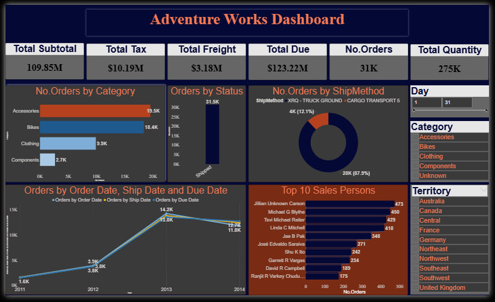

# AdventureWorks-DataModeling-Dashboard

This project analyzes the **Adventure Works dataset** using **Power BI**.  
It provides insights into sales performance, product categories, territories, salespersons, and order trends.  

## 🔹 Key Features
- **KPIs Overview**: Total Revenue, Orders, Quantity, Tax, and Freight.  
- **Sales Analysis**: Orders by Category, Territory, Ship Method, and Status.  
- **Trend Analysis**: Orders by Year, Due Date, and Ship Date.  
- **Top Performers**: Ranking of top 10 salespersons by number of orders.  
- **Interactive Filters**: Category, Territory, and Time filters for detailed analysis.  

## 📊 Dashboard Preview

## 🗂 Data Model
A **Star Schema** was implemented in Power BI:  
- **Fact Table**: Sales (Order, Product, Customer, Territory, Date, Ship Method, SalesPerson).  
- **Dimension Tables**: Product, Status, Territory, Date, ShipMethod, SalesPerson.  
- **Calculated Measures**: Orders, Total Due, Freight, Quantity.  

## 🔑 Insights
- **Accessories** are the leading category (~19.5K orders).  
- **2013** was the peak year with ~57K orders.  
- **Jillian Carson** ranked as top salesperson with 473 orders.  
- ~87% of orders shipped via **Cargo Transport**.  

## ⚙️ Tools & Technologies
- **Power BI** (Data Modeling, DAX, Visualizations)  
- **SQL Server** (Data source)  

---
🚀 This project demonstrates skills in **data modeling, DAX, visualization design, and business insights generation** using Power BI.
